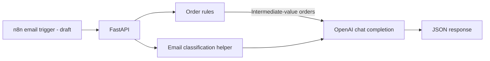

# Hyperautomation Platform

A small prototype combining FastAPI endpoints, OpenAI-backed decision helpers, and an n8n workflow draft. The current code demonstrates two request/response automations; it is not yet a complete, deployable hyperautomation platform.

## Business problem

Routine email triage and order review often combine repeatable rules with cases that need language understanding. This prototype shows how a workflow tool can call Python services for those decisions.

## Implemented features

- `POST /email/classify`: send an email subject, body, and sender to an OpenAI chat completion and return the model's JSON response.
- `POST /orders/evaluate`: automatically approve orders below 100, send orders above 50,000 for human review, and call OpenAI for values between those thresholds.
- `GET /health`: return a basic health response.
- `workflows/email_triage.json`: include a Gmail-trigger, HTTP-request, and switch-node workflow draft.
- `scripts/import_workflows.py`: provide a script that attempts to import JSON workflows through the n8n API.

The API is synchronous. The repository does not implement the CRM/spreadsheet/Slack sync, SLA escalation, persistence, or task queues described in the previous README.

## Architecture



The current email workflow JSON shows the intended trigger-to-API handoff. Credentials, activation, and end-to-end execution in n8n still need to be configured and verified.

## Requirements and local setup

Use Python 3.11, pip, and an OpenAI API key. The key is read from the process environment when the API module loads; a `.env` file is not loaded automatically.

```bash
git clone https://github.com/Kaique-ML/hyperautomation-platform.git
cd hyperautomation-platform
python -m venv .venv

# Windows PowerShell
.venv\Scripts\Activate.ps1
$env:OPENAI_API_KEY = "your-api-key"

# macOS/Linux
# source .venv/bin/activate
# export OPENAI_API_KEY="your-api-key"

python -m pip install --upgrade pip
pip install -r requirements.txt
uvicorn api.main:app --reload
```

Open `http://127.0.0.1:8000/docs` to inspect and call the endpoints. Requests to the classification endpoint and intermediate order evaluations use the OpenAI API and may incur provider charges.

## Example request

```bash
curl -X POST "http://127.0.0.1:8000/email/classify" \
  -H "Content-Type: application/json" \
  -d '{"subject":"Invoice question","body":"Could you confirm the invoice due date?","sender":"demo@example.com"}'
```

The response is generated by the configured model; no fixed result is promised.

## Tests and deployment status

There are currently no automated tests in the repository. The checked-in `docker-compose.yml` references a build context, but the repository does not contain the Dockerfile it needs; the documented Compose startup therefore is not currently a verified setup path. The local Python/API steps above reflect the checked-in files.

## Limitations and future work

**Current limitations**

- The n8n workflow is a draft without configured Gmail credentials or a verified activation/import path.
- Order decisions for intermediate values rely on unvalidated model-generated JSON. The API does not enforce a response schema or persist an approval record.
- The API has no authentication, retry policy, durable queue, database integration, or automated tests.
- The request does not provide the customer history mentioned in the worker prompt, so the model cannot actually use that context.
- The OpenAI key must be supplied at process start; avoid committing credentials or using development defaults outside a local demo.

**Possible future work (not implemented):** add contract and integration tests, validate model output, configure secure n8n credentials and callbacks, add durable state/retries, and make the container setup reproducible.
